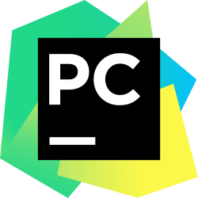

# DEV SKILLS

## HABILIDADES EN EL DESARROLLO

* Java

* Python

* Arduino

* SQL / MySQL

## HERRAMIENTAS

<table>
    <tr>
        <td>  </img> </td>
        <td>  </img> </td>
        <td>  </img> </td>
        <td>  </img> </td>
        <td>  </img> </td>
    </tr>
</table>

## TECNOLOGÍAS

* **Java** + Swing / JavaFX

* **Arduino** + sensores

* **MySQL** Workbench

***
 
<a href="README.md" style="background-color: white; color: black; padding: 5px; border-radius: 8px; text-decoration: none; display: inline-block; font-weight: bold">
  VOLVER AL INICIO
</a>
 